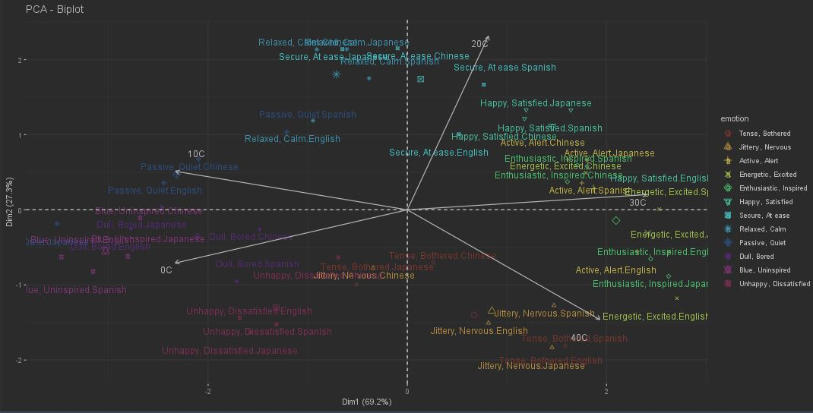

# emote-ping

## What is it?
Emote-ping is an application that is designed to send emotional data to specified family and friends in real time. The project is designed to be an iOS app with a watch extension.

## How Does it work?
Emote-ping works by reading taking in specific data. It relies on the current temperature and your heart rate data. The application will use these value and statistical data recieved from [The Natural Library of Science (NLS)](https://www.ncbi.nlm.nih.gov/pmc/articles/PMC8174739/#:~:text=First%2C%20emotions%20can%20have%20a,raise%20the%20internal%20body%20temperature) to predict the mood of the wearer. It also utilizes a weather api from the [the OpenWeatherAPI](https://openweathermap.org/) to get current temperature information in Celsius. It utalizes this data to come up with three possible emotions.

## Background
Science and inventions such as Mood Rings and experiment data have proven that there is a correlation between body temperature and emotions. Mood rings use a liquid film underneath their gems that causes the change in color. We used this as a basis for our theory on how to go about determining different emotions. After taking a closer look into this data, we were able to discover that emotion is related to two different values valence and arousal. Arousal is the change in pulse, or ΔHR for change in heart rate. Valence calculated chemically as the amount of electrons associated with a Carbon atom. The valence is hard to calculate, but after obeserving the graphs and charts from NLS, I was able to determine that I could use the equation of a circle to account for the value of the valence, with the radius being 1. We can use the formula ((5/2) * (ΔHR))^(1.56) to calculate for arousal. In the graph representing the the range of emotions we can determine that arousal was your y-axis and valence is your x-axis. 

 </img>

## Dependencies
[OpenWeatherAPI](https://openweathermap.org/)

[NSL](https://www.ncbi.nlm.nih.gov/pmc/articles/PMC8174739/#:~:text=First%2C%20emotions%20can%20have%20a,raise%20the%20internal%20body%20temperature)

## Future Works
We would like to impliment a Machine Learning or data science approach to this program. We can use either or both of them to make accurate predictions about a persons emotions. We also would need to get the frontend working with the backend of the application. Since the overall goal was to design an iOS application we still have to figure out the design of the actual watch UI and iOS UI. We could possibly extend this to having a feed of real time data that would be used to show how you are feeling at specific times of the day. We also still needed to look into ways of sending messages faster than using cell towers.

